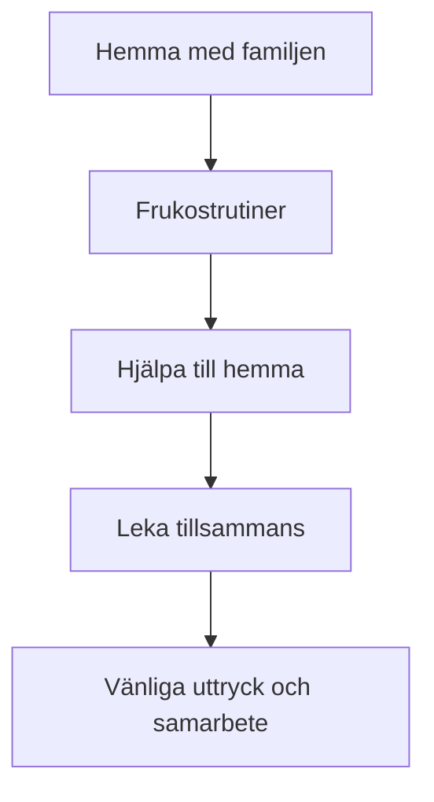

# Bluey hemma – familjesamtal

**Personer:** Pappa, Mamma, Bluey, Bingo

**Pappa:** God morgon! Är ni redo för frukost?
**Bluey:** Ja! Kan vi leka ”butik” efteråt?
**Mamma:** Först äter vi. Vad vill ni ha?
**Bingo:** Jag vill ha yoghurt och banan.
**Bluey:** Jag vill ha smörgås med ost.
**Pappa:** Okej, jag gör smörgåsar. Mamma häller upp mjölk.

**Mamma:** Bluey, kan du duka bordet?
**Bluey:** Ja, jag tar tallrikar och glas.
**Bingo:** Jag tar servetter!

**Pappa:** Bra jobbat. När vi har ätit kan vi leka.
**Bluey:** Vi kan låtsas att soffan är en båt!
**Bingo:** Och mattan är havet!
**Mamma:** Låter kul, men vi städar först.

**Bluey:** Okej. Jag plockar undan.
**Bingo:** Jag torkar bordet.
**Pappa:** Tack, ni är hjälpsamma.

**Mamma:** Redo att leka nu?
**Bluey:** Ja!
**Bingo:** Ja!
**Pappa:** Då kör vi. Välkomna ombord!

## Referens: Svenska–Engelska (dialog)

### Scen 1: Frukost

| ID | Svenska | Engelska |
|---|---|---|
| D1 | God morgon! Är ni redo för frukost? | Good morning! Are you ready for breakfast? |
| D2 | Ja! Kan vi leka ”butik” efteråt? | Yes! Can we play “shop” afterwards? |
| D3 | Först äter vi. Vad vill ni ha? | First we eat. What do you want? |
| D4 | Jag vill ha yoghurt och banan. | I want yogurt and banana. |
| D5 | Jag vill ha smörgås med ost. | I want a sandwich with cheese. |
| D6 | Okej, jag gör smörgåsar. Mamma häller upp mjölk. | Okay, I’ll make sandwiches. Mom pours the milk. |
| D7 | Bluey, kan du duka bordet? | Bluey, can you set the table? |
| D8 | Ja, jag tar tallrikar och glas. | Yes, I’ll take plates and glasses. |
| D9 | Jag tar servetter! | I’ll take napkins! |

### Scen 2: Städning och lek

| ID | Svenska | Engelska |
|---|---|---|
| D10 | Bra jobbat. När vi har ätit kan vi leka. | Well done. When we have eaten, we can play. |
| D11 | Vi kan låtsas att soffan är en båt! | We can pretend the sofa is a boat! |
| D12 | Och mattan är havet! | And the rug is the sea! |
| D13 | Låter kul, men vi städar först. | Sounds fun, but we clean up first. |
| D14 | Okej. Jag plockar undan. | Okay. I’ll tidy up. |
| D15 | Jag torkar bordet. | I’ll wipe the table. |
| D16 | Tack, ni är hjälpsamma. | Thanks, you are helpful. |
| D17 | Redo att leka nu? | Ready to play now? |
| D18 | Ja! | Yes! |
| D19 | Då kör vi. Välkomna ombord! | Here we go. Welcome aboard! |

## Visual: Målet med dialogen

## 5 exempel (mönster)

### Exempel 1
1️⃣ **Olika texttyper + Ordid**: *Köksbord* (substantiv, n-ord)
2️⃣ **Grammatikform**: singular obestämd/bestämd – ett köksbord / köksbordet
3️⃣ **Betydelse**: bordet i köket där familjen äter
4️⃣ **Demonstrativa exempel**:
- det köksbordet
- detta köksbord
- den här köksbordet
- den där köksbordet
5️⃣ **Meningsmönster**: *Det är + substantiv + som + verb*
6️⃣ **Situationsanvändning**: Frukost hemma
7️⃣ **Kort kontextstory**: Bluey lägger tallrikar på köksbordet och Bingo torkar av det.

### Exempel 2
1️⃣ **Olika texttyper + Ordid**: *Kylskåp* (substantiv, n-ord)
2️⃣ **Grammatikform**: singular bestämd – kylskåpet
3️⃣ **Betydelse**: skåpet där maten hålls kall
4️⃣ **Demonstrativa exempel**:
- det kylskåpet
- detta kylskåp
- den här kylskåpet
- den där kylskåpet
5️⃣ **Meningsmönster**: *Vi ska + verb + i + substantiv*
6️⃣ **Situationsanvändning**: Hämta frukost
7️⃣ **Kort kontextstory**: Pappa öppnar kylskåpet och tar fram mjölk.

### Exempel 3
1️⃣ **Olika texttyper + Ordid**: *Smörgås* (substantiv, en-ord)
2️⃣ **Grammatikform**: plural bestämd – smörgåsarna
3️⃣ **Betydelse**: bröd med pålägg
4️⃣ **Demonstrativa exempel**:
- den smörgåsen
- denna smörgås
- den här smörgåsen
- den där smörgåsen
5️⃣ **Meningsmönster**: *Jag vill ha + substantiv*
6️⃣ **Situationsanvändning**: Beställa frukost hemma
7️⃣ **Kort kontextstory**: Bluey säger att hon vill ha den här smörgåsen med ost.

### Exempel 4
1️⃣ **Olika texttyper + Ordid**: *Servett* (substantiv, en-ord)
2️⃣ **Grammatikform**: plural obestämd – servetter
3️⃣ **Betydelse**: papper man torkar sig med vid matbordet
4️⃣ **Demonstrativa exempel**:
- den servetten
- denna servett
- den här servetten
- den där servetten
5️⃣ **Meningsmönster**: *Kan du + verb + substantiv?*
6️⃣ **Situationsanvändning**: Duka bordet
7️⃣ **Kort kontextstory**: Mamma ber Bingo hämta servetter till bordet.

### Exempel 5
1️⃣ **Olika texttyper + Ordid**: *Soffa* (substantiv, en-ord)
2️⃣ **Grammatikform**: singular bestämd – soffan
3️⃣ **Betydelse**: möbel där man sitter i vardagsrummet
4️⃣ **Demonstrativa exempel**:
- den soffan
- denna soffa
- den här soffan
- den där soffan
5️⃣ **Meningsmönster**: *Vi kan + verb + som + substantiv*
6️⃣ **Situationsanvändning**: Leka hemma
7️⃣ **Kort kontextstory**: Barnen låtsas att den här soffan är en båt.
