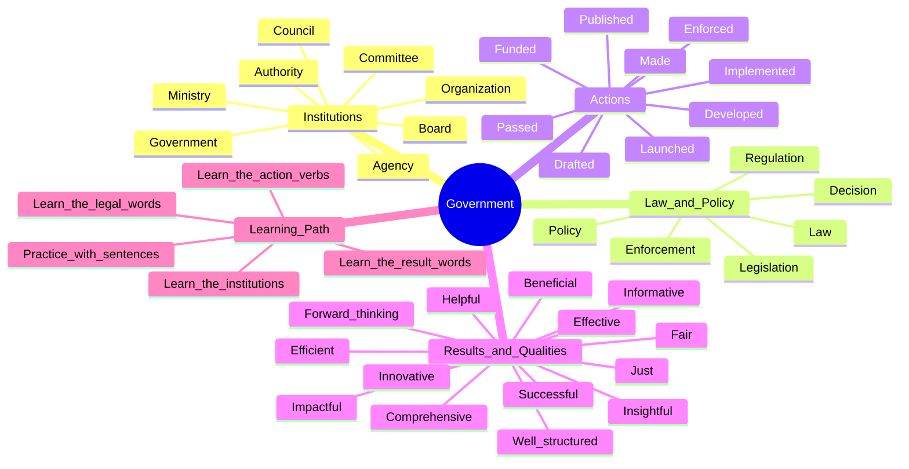

# Government Mind Map

This page groups government vocabulary into a simple structure so you can learn from the center outward.

## How the Structure Works

1. Start from the center topic: `Government`.
2. Move to the main branches: `Institutions`, `Law and Policy`, `Actions`, `Results`, and `Example Sentences`.
3. Under each branch, learn the words in groups instead of one by one.
4. Use the comparison notes to understand similar words such as `law`, `policy`, and `legislation`.
5. Use the example sentences last, after the vocabulary groups are clear.

## Mind Map

## Main Branches Explained

### 1) Institutions

These are the groups or bodies that make decisions, guide policy, or carry out public work.

- government - svenska: regering - tamil: அரசாங்கம்
- ministry - svenska: ministerium - tamil: அமைச்சகம்
- council - svenska: råd - tamil: கவுன்சில்
- authority - svenska: myndighet - tamil: அதிகாரம்
- agency - svenska: byrå / myndighet - tamil: முகமை
- organization - svenska: organisation - tamil: அமைப்பு
- committee - svenska: kommitté - tamil: குழு
- board - svenska: styrelse - tamil: வாரியம்

### 2) Law and Policy

This branch explains the legal and administrative side of government.

- law - svenska: lag - tamil: சட்டம்
- policy - svenska: politik / policy - tamil: கொள்கை
- legislation - svenska: lagstiftning - tamil: சட்டமூலம் / lagstiftningsprocess
- decision - svenska: beslut - tamil: முடிவு
- regulation - svenska: reglering / föreskrift - tamil: ஒழுங்குமுறை
- enforcement - svenska: verkställighet / upprätthållande - tamil: அமல்படுத்தல்

### 3) Actions

These are common verbs used when talking about what government bodies do.

- passed - antogs
- made - fattades
- implemented - genomfördes
- enforced - upprätthölls
- developed - utvecklades
- launched - lanserades
- funded - finansierades
- drafted - utarbetades
- published - publicerades

### 4) Results and Qualities

These words describe how a decision, report, law, or project is received.

- effective - effektiv
- efficient - ändamålsenlig / effektiv
- fair - rättvis
- just - rättmätig / rättvis
- beneficial - fördelaktig
- helpful - hjälpsam
- innovative - innovativ
- forward-thinking - framåtblickande
- comprehensive - omfattande
- well-structured - välstrukturerad
- informative - informativ
- insightful - insiktsfull
- successful - framgångsrik
- impactful - betydelsefull / påverkningsfull

## Key Comparisons

### Law vs Policy vs Legislation

- Law: a rule that is legally enforceable.
- Policy: a plan or guiding principle for decisions and action.
- Legislation: the formal laws created by a legislative body, and also the law-making process.

Simple example:

The government introduced a new policy to reduce carbon emissions. Later, legislation was passed in parliament to give that policy legal force.

### Committee vs Council vs Board

- Committee: a group formed for a specific task or issue.
- Council: a decision-making or advisory body, often local or regional.
- Board: a group responsible for governance and strategic direction.

### Council vs Ministry

- Council: usually discusses, advises, or decides on local or specific matters.
- Ministry: a government department responsible for a public policy area.

Simple example:

The city council consulted the Ministry of Transport on the new traffic regulations.

## How They Work Together

- Committees often study a specific issue.
- Councils review recommendations and make decisions.
- Boards oversee governance and direction.
- Ministries support implementation, public administration, and policy execution.

Simple flow:

Committee -> Council -> Ministry / Authority -> Public implementation

## Example Sentences

- The law was passed by the parliament.
    - Lagen antogs av riksdagen.
    - tamil: சட்டம் பாராளுமன்றத்தால் நிறைவேற்றப்பட்டது.

- The decision was made by the council and it was received as creative and innovative.
    - Beslutet fattades av rådet och det mottogs som kreativt och innovativt.
    - tamil: முடிவு கவுன்சிலால் எடுக்கப்பட்டது மற்றும் அது படைப்பாற்றல் மற்றும் புதுமையானதாக பெறப்பட்டது.

- The policy was implemented by the government and it was received as effective and efficient.
    - Policyn genomfördes av regeringen och det mottogs som effektivt och ändamålsenligt.
    - tamil: கொள்கை அரசாங்கத்தால் நடைமுறைப்படுத்தப்பட்டது மற்றும் அது பயனுள்ளதாகவும் திறமையாகவும் பெறப்பட்டது.

- The regulations were enforced by the authorities and they were received as fair and just.
    - Reglerna upprätthölls av myndigheterna och de mottogs som rättvisa och rättmätiga.
    - tamil: விதிகள் அதிகாரிகளால் அமுல்படுத்தப்பட்டன மற்றும் அவை நியாயமான மற்றும் நீதிமானாக பெறப்பட்டன.

- The program was developed by the ministry and it was received as beneficial and helpful.
    - Programmet utvecklades av ministeriet och det mottogs som fördelaktigt och hjälpsamt.
    - tamil: திட்டம் அமைச்சகத்தால் உருவாக்கப்பட்டது மற்றும் அது பயனுள்ளதாகவும் உதவியாகவும் பெறப்பட்டது.

- The initiative was launched by the organization and it was received as innovative and forward-thinking.
    - Initiativet lanserades av organisationen och det mottogs som innovativt och framåtblickande.
    - tamil: முன்னெடுப்பு அமைப்பால் தொடங்கப்பட்டது மற்றும் அது புதுமையான மற்றும் முன்னேற்றமானதாக பெறப்பட்டது.

- The project was funded by the government and it was received as successful and impactful.
    - Projektet finansierades av regeringen och det mottogs som framgångsrikt och betydelsefullt.
    - tamil: திட்டம் அரசாங்கத்தால் நிதியளிக்கப்பட்டது மற்றும் அது வெற்றிகரமாகவும் தாக்கமிக்கதாக பெறப்பட்டது.

- The legislation was drafted by the committee and it was received as comprehensive and well-structured.
    - Lagstiftningen utarbetades av kommittén och den mottogs som omfattande och välstrukturerad.
    - tamil: சட்டம் குழுவால் உருவாக்கப்பட்டது மற்றும் அது விரிவான மற்றும் நன்கு கட்டமைக்கப்பட்டதாக பெறப்பட்டது.

- The report was published by the agency and it was received as informative and insightful.
    - Rapporten publicerades av myndigheten och den mottogs som informativ och insiktsfull.
    - tamil: அறிக்கை முகமை வெளியிட்டது மற்றும் அது தகவல்தரமான மற்றும் உள்ளுணர்வானதாக பெறப்பட்டது.

## Suggested Study Order

1. Learn the institution words first.
2. Then learn the legal words: law, policy, legislation.
3. Then connect them with the action verbs.
4. Then add result words such as effective, fair, and innovative.
5. Finally, practice with the example sentences.
